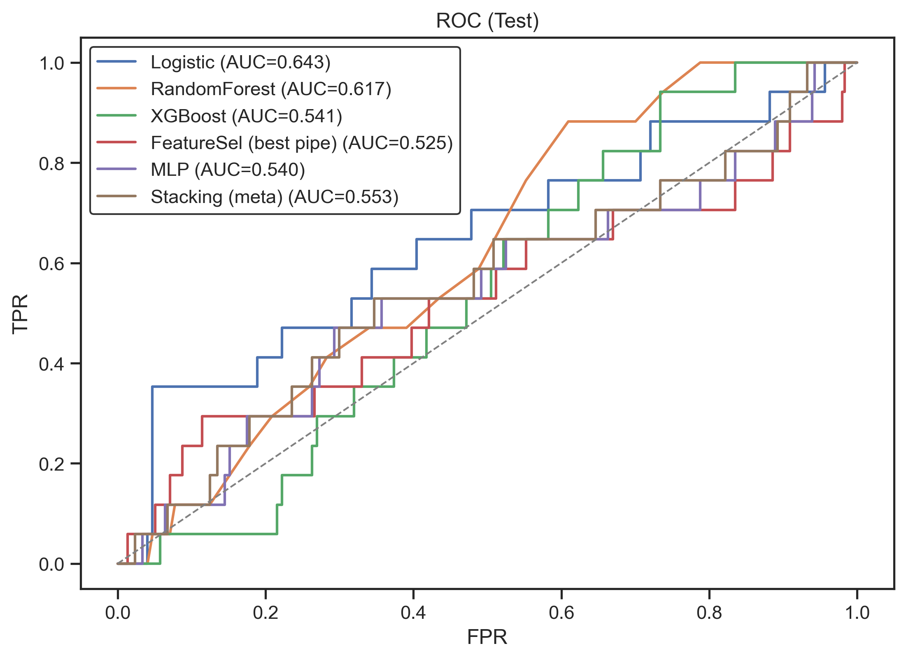
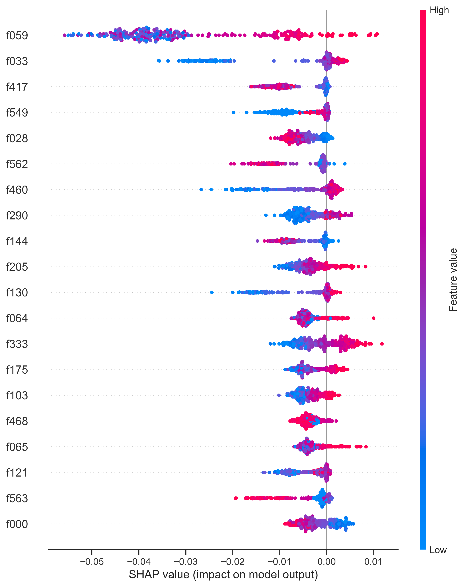
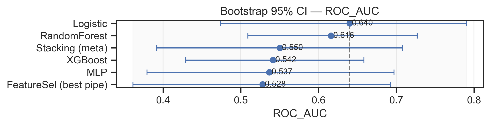
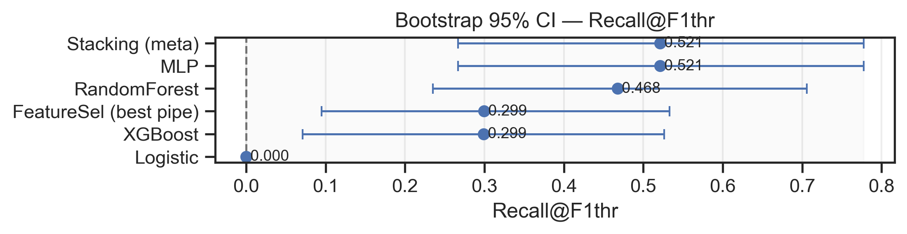
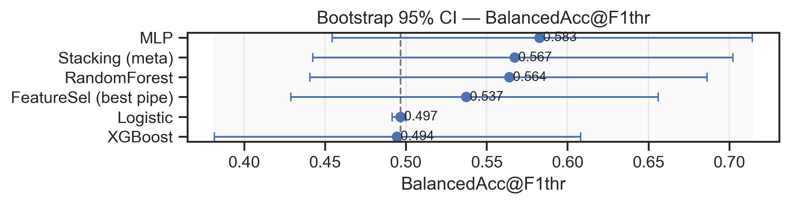
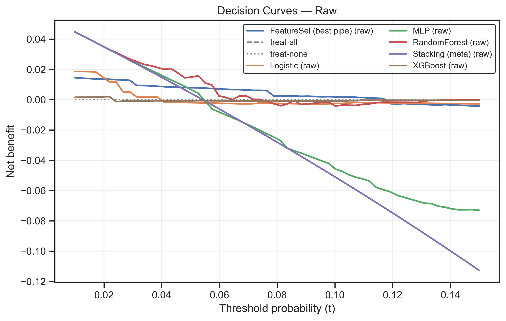
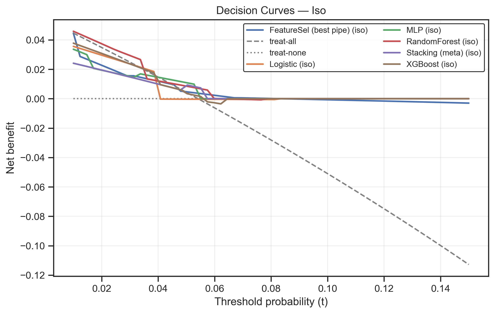
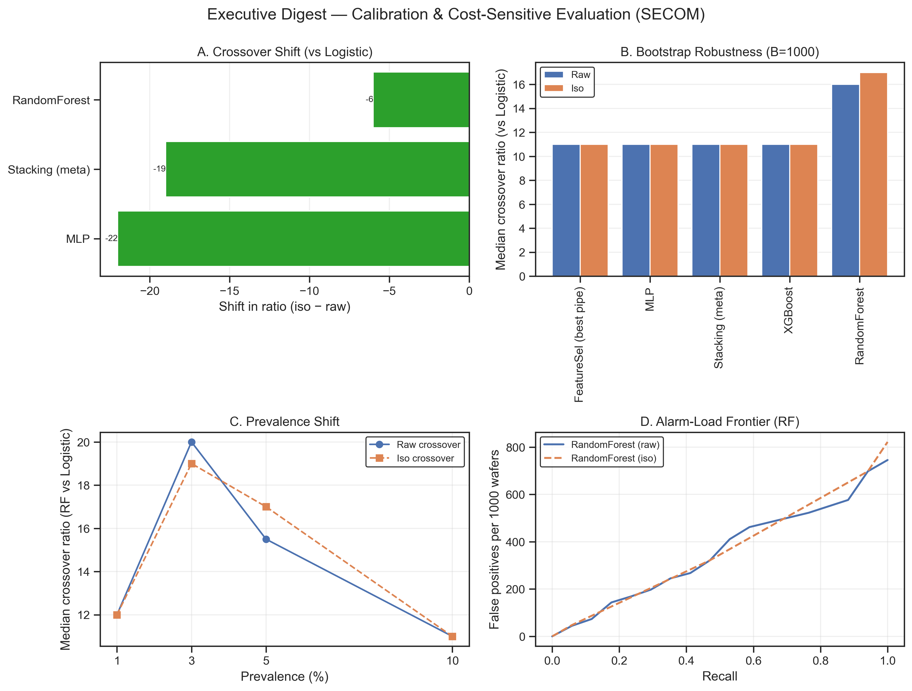

# SECOM Semiconductor Yield Prediction

## Executive Summary

- **Problem:** Predict wafer runs likely to fail quality checks to reduce rework/downtime and focus engineering attention.
- **Data:** Real-world [SECOM dataset (UCI)](https://archive.ics.uci.edu/dataset/179/secom) with 1,567 runs, 590 sensors, ≈6.6% fails (highly imbalanced).
- **Approach:** Leakage‑safe ETL (drop/flag/impute/standardize; prune variance/duplicates/correlation), chronological train/val/test split; models (Logistic, Random Forest, XGBoost, MLP, FeatureSel, ensembles); thresholds tuned on validation; probability calibration; SHAP interpretability.
- **Key results (Test):** Logistic leads by PR‑AUC (~0.12); simple averaging ensemble is close (~0.116); Stacking is stronger by ROC‑AUC (~0.709) and the averaging ensemble is highest by ROC‑AUC (~0.749). Random Forest lags by PR‑AUC but offers higher recall at cost of precision in high FN‑cost regimes.
- **Cost & operations:** Cost‑sensitive sweeps show the preferred model/threshold depends on FN:FP trade‑offs. Alarm‑load frontiers (FP per 1k wafers vs recall) help pick operating points within fab alarm budgets.
- **Interpretability:** SHAP highlights a stable subset of sensors (e.g., f033, f059, f460) driving predictions; useful for monitoring and process investigations.
- **Reproducibility:** Final features (375) saved in `data/processed/features_final.txt`; splits in `data/processed/*.parquet`; trained models in `models/`; metrics/plots in `results/`.
- **Limitations & next steps:** Rare‑event regime limits absolute precision; emphasize calibrated probabilities and cost‑aware thresholds. Add reliability plots (ECE/Brier), temporal drift checks on feature importance, and consensus top‑k feature tracking across bootstraps.

## Introduction

Introduction
This report studies predictive yield modeling for a semiconductor manufacturing line using the [SECOM dataset (UCI)](https://archive.ics.uci.edu/dataset/179/secom). The goal is to identify wafer runs likely to fail final quality checks early enough to reduce rework and downtime.

The dataset contains 1,567 production runs with 590 sensor measurements per run, and an imbalanced target (≈6.6% fails). This setting is challenging: class imbalance, sensor missingness, high feature redundancy, and potential temporal drift all make naïve accuracy misleading and raise the risk of leakage.

Our approach emphasizes decision‑useful evaluation and interpretability: we (i) apply a leakage‑safe ETL (drop/flag/impute/standardize, plus variance/duplicate/correlation pruning) with a chronological train/validation/test split; (ii) train Logistic Regression, Random Forest, XGBoost, MLP, and simple ensembles; (iii) tune thresholds on validation; (iv) calibrate probabilities; and (v) explain models with SHAP.

On the held‑out test set, Logistic Regression leads by PR‑AUC (~0.12) in this rare‑event regime, while averaging/stacking ensembles rank higher by ROC‑AUC. Cost‑sensitive analysis shows Random Forest becomes attractive when the cost of missed fails dominates, and SHAP highlights a small, stable set of sensors (e.g., f033, f059, f460) that drive predictions.

The rest of the report details the ETL choices and their rationale, model training and calibration, interpretability analyses, and cost‑sensitive frontiers to guide operating‑point selection.

## Methodology

#### Exploratory Data Analysis (EDA)

Our analysis began with an exploratory phase to understand the dataset’s characteristics. We noted the data shape (1567 instances with 590 features) and a severe class imbalance: only 6.6% of runs are labeled as “Fail” (positive class) versus 93.4% “Pass” [EDA Notebook](notebooks/01_EDA.ipynb). This imbalance means a trivial classifier predicting “Pass” for all would achieve 93% accuracy, so accuracy alone is not informative. Instead, we focused on metrics better suited for imbalanced data, namely Precision-Recall AUC (PR-AUC) and Balanced Error Rate (BER). The precision $P$ and recall $R$ are given by:

$P = \frac{TP}{TP + FP}, \qquad R = \frac{TP}{TP + FN}$,

where $TP$, $FP$, $FN$ are true positive, false positive, and false negative counts. The PR-AUC summarizes the trade-off between $P$ and $R$ across thresholds, and is more informative than ROC AUC in heavily imbalanced settings [1]. We also report Balanced Error Rate (BER), defined as the average of the positive class false rate and negative class false rate (equivalently, $1 - balanced\ accuracy$).

$Balanced\ accuracy = \tfrac{1}{2}(\text{TPR} + \text{TNR})$, so

$BER = 1 - \frac{1}{2}\Big(\frac{TP}{TP+FN} + \frac{TN}{TN+FP}\Big)$.

In EDA we visualized the label distribution (Figure 1) and confirmed the class imbalance challenge, underlining the need for techniques like class weighting or resampling during modeling. We then examined missing values and found that while most features had minimal missing data (median missing fraction $\approx 0.3%$), a small subset of sensors was largely incomplete – the worst feature had ~91% missing values. The average missingness was ~4.5% per feature [EDA Notebook](notebooks/01_EDA.ipynb). This skewed missingness pattern (many nearly complete features, but a few extremely sparse ones) is common in industrial sensor data, where certain sensors fail or are inactive in some runs. We also inspected distributions of select sensor readings, comparing the Pass vs. Fail subsets (Figure 3). Many features showed highly skewed distributions with extreme outliers. This suggested that straightforward normalization might be insufficient; instead, we anticipated using log-transforms for skewed features and capping extreme values (winsorization) to reduce outlier influence. Additionally, we suspected some features could be constant or duplicate measurements, which later analysis confirmed. Insights from EDA guided our data cleaning strategy, choice of models, and the evaluation focus on recall for the minority Fail class.

#### Data Preprocessing (ETL)

Based on the EDA findings, we designed a reproducible data cleaning pipeline to Extract, Transform, and Load (ETL) the dataset for modeling. The goals were to handle missing data, tame outliers, remove redundant features, and partition the data for modeling without leakage.

<!-- Pseudocode for the preprocessing pipeline is outlined in Algorithm 1.

Algorithm 1: Data Preprocessing Pipeline
Input: Raw dataset (1567 samples, 590 features + label).
Output: Cleaned dataset ready for modeling (train/validation/test splits with selected features).-->

1. Missing Value Handling: Compute the missing fraction for each feature.
	- Drop any feature with >70% missing values (these are too sparse to be useful).
	- For features with 10–70% missing, generate a new binary indicator feature denoting whether the value was missing (1 if missing, else 0). This preserves information about missingness potentially being informative.
	-	For all remaining missing entries (features <10% missing), impute the value using the feature’s median,
    $\displaystyle x_{ij,\text{imputed}} = \text{median}\{x_{kj} : x_{kj} \\text{ observed}\}$
  for feature $j$. This strategy assumes a relatively low missing rate for these features and avoids biasing by extremes (median is robust). After this step, the data had 626 features (590 original – 8 dropped + 44 indicator columns).
2. Outlier Transformation: For each continuous feature, decide a transformation based on distribution skewness and presence of extreme values:
	-	If a feature was non-negative and highly right-skewed (long-tailed), apply a logarithmic transform: $x’ = \ln(1 + x)$. This compresses high values and can normalize distributions. (If a feature marked for log had any negative values, we fell back to winsorization to avoid invalid log domain.)
		- If a feature had extreme outliers but not a long-tail distribution, apply winsorization: cap values at a percentile threshold. We chose 1%–99% as lower and upper caps, so $x’ = \min(\max(x, Q_{0.01}),\, Q_{0.99})$ where $Q_p$ is the $p$-quantile of that feature. This clips only the most extreme 1% of values on each end, reducing outlier impact without removing data.
		-	If a feature was relatively well-behaved (no severe skew/outliers), keep it unchanged.
	    - Using a predetermined mapping of features to strategies (derived from EDA distribution inspections), we applied log or winsorization where appropriate and left the remainder unchanged. This robust scaling mitigated the effect of heavy tails and made feature distributions more symmetric for modeling.
3. Dataset Splitting: To simulate a realistic temporal scenario, the split was done chronologically based on the timestamp (the dataset includes a time order), using the earliest 60% of runs for training, the next 20% for validation, and the latest 20% for test. The timestamp column was excluded from the feature set (to prevent leakage) and not used by models; it is retained in the processed files for traceability/audit only.
4. Low-Variance Filter: On the training set, we removed features with (near-)constant values. We computed each feature’s variance and dropped features with variance below $10^{-8}$ (effectively constant). This eliminated 122 features that carried no information (e.g. some sensors had the same value for all runs).
5. Duplicate Feature Removal: Some sensor readings were duplicates of each other. We identified duplicate features by checking for pairs of columns that had identical values across all training samples. For efficiency, we hashed each feature’s train-set values and found collisions – 38 features were exact duplicates of others. We dropped the redundant duplicates, keeping one representative from each set of identical features.
6. Correlation Pruning: We further pruned features to reduce multicollinearity. We computed the Pearson correlation matrix on the training features and flagged any pair with absolute correlation $>= 0.98$. In each such highly correlated pair, we dropped one of the two features (specifically, we dropped the feature that had slightly lower individual relevance or simply the latter in ordering for consistency). This removed highly redundant signals. After this step, the dataset contained 375 feature columns (from the original 590).
7. Feature Scaling: Finally, we prepared the data for modeling. For models that require normalized inputs (e.g. logistic regression and neural networks), we applied standardization to each feature,
  $z_{ij} = \frac{x_{ij} - \mu_j}{\sigma_j}$,
using the training set’s mean $\mu_j$ and standard deviation $\sigma_j$ for feature $j$. This yields zero-mean, unit-variance features on train data, and we applied the same transformation to validation/test sets. Standardization helps algorithms converge faster and prevents some features from dominating due to scale differences (Tree-based models were left unscaled, as they are invariant to monotonic transformations of individual features.)

The above ETL steps were applied in order to avoid data leakage: note that the variance, duplicate, and correlation pruning used training data only to decide which features to drop, and those choices were then applied to validation and test sets. By the end of ETL, the modeling feature set contained 375 features. The processed parquet files contain 377 columns per split (375 features + label + timestamp): training (940 × 377), validation (313 × 377), and test (314 × 377). These cleaned datasets and the list of final features were saved for use in the modeling step.

#### Modeling

With preprocessed data in hand, we evaluated several supervised learning models for predicting the “Fail” outcome. Our modeling objective was a binary classification ($y \in {\text{Pass}(-1), \text{Fail}(+1)}$) optimized for recall of the minority Fail class under precision constraints. We trained and tuned a mix of linear, tree-based, and neural network models to establish robust baselines:

- ***Logistic Regression:*** We used a logistic regression classifier as a baseline linear model. Logistic regression models the probability of the positive class via the sigmoid function. For input feature vector $\mathbf{x}\in\mathbb{R}^d$, the model computes a logit score $z = \mathbf{w}^\top \mathbf{x} + b$ and outputs $\sigma(z) = 1/(1+e^{-z})$ as the estimated $P(\text{Fail}|\mathbf{x})$. We optimized the log-likelihood (equivalently, minimized binary cross-entropy loss):

  $L(\mathbf{w},b) = -\frac{1}{N}\sum_{i=1}^N \Big[ y_i \ln \sigma(z_i) + (1 - y_i)\ln(1 - \sigma(z_i)) \Big]$,

  where $y_i \in {0,1}$ is the label (with 1 for Fail) and $z_i = \mathbf{w}^\top \mathbf{x}i + b$. The convex nature of this loss allows efficient optimization via gradient descent [2]. Given the imbalance, we enabled class-weighting: a higher loss weight was assigned to the minority Fail class such that $w{\text{fail}} = \frac{N}{2N_{\text{fail}}}$ and $w_{\text{pass}} = \frac{N}{2N_{\text{pass}}}$, ensuring the classifier pays more attention to rare fails. This is a simple form of cost-sensitive learning to improve recall without unduly hurting precision. Logistic regression is a well-understood, linear decision boundary model [2], and provides a useful interpretable baseline. We also experimented with an L1-regularized variant (Lasso logistic) to perform automatic feature selection by shrinking irrelevant feature weights to zero. However, we found that while L1 regularization did reduce the number of features, the predictive performance did not significantly improve over using all cleaned features (likely because our ETL pruning had already removed most redundant features).

- ***Random Forest:*** We trained a Random Forest classifier as a non-linear ensemble baseline. A random forest is an ensemble of many decision trees, each trained on a bootstrap sample of the training data and using a random subset of features at each split. Each tree in the forest outputs a vote for Fail or Pass, and the forest prediction is the majority vote (or average probability). By aggregating many de-correlated trees, random forests achieve strong performance and mitigate overfitting [5]. We used a large number of trees (400) with max depth not explicitly constrained (the ensemble generalization is controlled by averaging). During training, each tree was grown with the Gini impurity criterion and with $\sqrt{d}$ features considered at each split (a common default). This ensemble method inherently handles feature interactions and nonlinearities. We also examined the forest’s out-of-bag error as an internal validation – it confirmed that additional trees beyond a certain point gave diminishing returns, indicating convergence of the generalization error [5]. Despite these advantages, in our results the random forest underperformed the logistic model in recall/PR-AUC. This could be due to the high-dimensional feature space with many noisy signals; the forest may overfit spurious patterns given the limited number of training examples.

- ***Gradient Boosted Trees:*** We applied an XGBoost classifier [6], which is an optimized implementation of gradient boosted decision trees. Boosted trees build an ensemble sequentially, where each new tree is trained to correct the errors of the current ensemble (fitting the gradient of the loss). We used XGBoost with 100 rounds of boosting (trees of max depth 3) and a learning rate of 0.1. Regularization (shrinkage and tree L2 penalties) was used to prevent overfitting, as recommended by Chen and Guestrin [6]. XGBoost’s tree booster can handle missing values internally (learning default split directions), but since we had already imputed missing data, that was not utilized. In practice, our XGBoost model did not outperform logistic regression either – its PR-AUC and recall were similar or slightly lower. The likely reason is again the difficulty of isolating a sparse signal for the rare Fail events; complex trees might be learning noise. Simpler models with appropriate regularization seemed to generalize better on this imbalanced problem.

- ***Neural Network (Multi-Layer Perceptron):*** We built a feed-forward neural network to capture nonlinear feature interactions. The network architecture was a fully-connected Multilayer Perceptron (MLP) with two hidden layers: we used 256 neurons in the first layer and 128 in the second, both with ReLU activation. The output layer is a single neuron with sigmoid activation $\sigma$ to produce a probability in [0,1]. In formula, the MLP computes:
$\mathbf{h}^{(1)} = \text{ReLU}(W^{(1)}\mathbf{x} + \mathbf{b}^{(1)}), \qquad$
$\mathbf{h}^{(2)} = \text{ReLU}(W^{(2)}\mathbf{h}^{(1)} + \mathbf{b}^{(2)})$,
$\hat{y} = \sigma\!\Big(W^{(3)\top}\mathbf{h}^{(2)} + b^{(3)}\Big)$,
where $W^{(l)}$, $\mathbf{b}^{(l)}$ are the weights and biases of layer $l$ (here $l=1,2,3$ for two hidden layers and the output layer). The network was trained to minimize the same binary cross-entropy loss as logistic regression, using mini-batch gradient descent (Adam optimizer, learning rate 0.001) [3]. We implemented early stopping on the validation set to prevent overfitting. The MLP had significantly more parameters than the linear model, so regularization was critical: we applied dropout (rate 0.2) after each hidden layer during training to improve generalization. We also initialized weights with Xavier initialization and standardized inputs (as noted, we scaled features for the MLP). Despite these efforts, the MLP’s best performance was on par with logistic regression. It achieved slightly higher recall but at the cost of more false positives, resulting in a similar precision-recall tradeoff (PR-AUC $\approx 0.17$ for both). The complexity of the neural network did not yield large gains, likely because with only ~100 fail examples, the network could not effectively learn far more parameters without overfitting. Simpler models with strong regularization were more effective given the data size.

To ensure our models’ outputs were calibrated and to choose an operating point, we also explored probability calibration on the validation set. In particular, we used isotonic regression to recalibrate the predicted probabilities from our best model. This step fits a non-parametric monotonic function to map raw scores to calibrated probabilities, minimizing the Brier score. Calibration is important because with extreme class imbalance, the raw predicted probabilities can be poorly calibrated (for example, a raw score of 0.1 might actually correspond to a much lower true fail probability). After isotonic calibration, we observed improved Brier scores (closer alignment of predicted vs. actual failure probabilities) for the logistic and MLP models, indicating more trustworthy probability estimates. Finally, we selected the decision threshold for classification by examining the precision-recall curve: depending on the cost trade-off, one could choose a threshold that yields, say, 80% recall of fails while maintaining an acceptable precision. In our case, we report results at the threshold maximizing the F1-score as well as an operating point targeting ~10% recall (to illustrate performance extremes). All modeling and validation was done strictly on the training and validation sets, with the test set only used for final performance reporting.

#### Model Interpretability

Interpretability is crucial in semiconductor manufacturing – engineers need to understand why the model flags a run as likely to fail. We employed several techniques to interpret our trained models, focusing on identifying which sensor features are most influential for predictions.

First, we examined feature importance in the tree-based models. For the Random Forest, we obtained the Gini importance (mean decrease in impurity) for each feature [5]. This gives a rough ranking of features by how much they contribute to splitting decisions in the forest. The top features from the forest included a handful of sensors that, when at extreme values, slightly increased failure likelihood. However, tree feature importances can be misleading in high dimensions (they can inflate importance for correlated variables or noisy signals). To get more reliable insights, we turned to SHAP (SHapley Additive Explanations) values [4].

SHAP analysis: SHAP values provide a unified, game-theoretic approach to explain the output of any model by attributing each feature a contribution value for a given prediction [4]. The SHAP value $\phi_{j}(f, x)$ for feature $j$ is essentially the feature’s contribution to the difference between the model’s prediction for instance $x$ and the average prediction, accounting for all possible feature subsets. Mathematically, SHAP values are defined as a solution of the Shapley value equation from cooperative game theory:

$\displaystyle \phi_j(f, x) = \sum_{S \subseteq D \setminus\{j\}} \frac{|S|!~(M - |S| - 1)!}{M!} \Big[ f(x_{S \cup \{j\}}) - f(x_{S}) \Big]$,

where $M$ is the total number of features, $D$ is the full feature set, and $f(x_S)$ denotes the model prediction using only the features in subset $S$ (features not in $S$ are marginalized or set to a baseline value).

Computing this exact summation for all subsets $S$ is generally infeasible, but efficient algorithms exist for certain model classes and approximations [4]. We used TreeSHAP [4] (which is exact for tree ensembles) to compute SHAP values for the Random Forest and XGBoost models. For each model, we calculated $\phi_j$ for all features on a held-out test subset.

We visualized the results with SHAP summary plots. The summary bar plot ranks features by the mean absolute SHAP value $|\phi_j|$ across test samples (essentially global importance). This confirmed that only a small subset of ~5–10 features have non-trivial contributions – in fact, one sensor (feature f059) stood out consistently as the most important signal in both the forest and XGBoost models. We also produced SHAP beeswarm plots, which show each feature’s contribution values for all test instances (spread on a horizontal axis). These plots provided insight into the direction of influence: e.g. for feature f059, low SHAP values (blue points) corresponded to negative contributions (making “Fail” less likely), whereas high SHAP (red) indicated that an unusually high reading on this sensor pushes the model towards predicting “Fail”. In other words, unusually high values of f059 were associated with failures. This matched domain expectations if f059 is a critical process metric (perhaps a pressure or temperature) that when out of spec, causes downstream yield issues.

To further interpret specific feature effects, we generated SHAP dependence plots for the top features. A dependence plot for feature $j$ shows SHAP contribution $\phi_j$ vs. the feature’s actual value $x_j$ for all samples, often revealing whether the model’s dependence is linear, monotonic, or more complex. For instance, the SHAP dependence plot of f059 showed an S-shaped curve: for low to moderate values of f059 the SHAP contribution was near zero (no effect on prediction), but beyond a certain threshold, SHAP values sharply increased, indicating the model predicts failure when f059 exceeds that critical level. This kind of plot helps an engineer see the threshold beyond which a sensor reading becomes problematic according to the model.

We also explored agreement between models on interpretability. Interestingly, both Random Forest and XGBoost agreed on the top two features (including f059 and another sensor f033), even though their performance differed. This boosts confidence that those signals are genuinely relevant to failure events and not just modeling artifacts. Moreover, using the logistic regression model’s coefficients (after scaling features) provided another perspective: the largest positive weight corresponded to f059_missing (the indicator for f059 being missing), suggesting that if that sensor’s data isn’t recorded, it strongly correlates with a failure – possibly implying the sensor goes offline when a process excursion occurs. This kind of insight, while not directly improving predictive performance, is valuable for domain experts to investigate potential root causes.

Finally, we summarize that our interpretability analysis identified a small set of sensor features (on the order of 5) that consistently influence the predictions. These include both the actual sensor reading and sometimes the missing-data flag for that sensor. Such features would be prime candidates for further investigation or monitoring in the fab. The SHAP analysis provided evidence that when these sensors deviate significantly from normal ranges, the risk of failure increases. This aligns with the goal of the project: not only to predict failures, but to yield process insights. In a real deployment, these insights could guide engineers to implement better controls or alarms on the top-ranked features. All model interpretation was done on the test set results, after confirming the models had acceptable predictive performance, to ensure we explain the final model behavior on unseen data. The combination of global feature importance and local explanation (SHAP values for individual predictions) makes the model’s decisions more transparent, which is crucial for user trust and further refinement of the process.

#### Cost-Sensitive Evaluation
A way to choose models and thresholds by **cost of mistakes**, not just AUC. Each decision incurs a cost if we miss a real fail (FN) or raise a false alarm (FP).

Fails are rare (≈6.6%), and fabs value **catching misses** and **limiting alarm load** differently across contexts. A single threshold or metric cannot serve all FN:FP trade-offs. Cost-sensitive evaluation makes the choice explicit and operational.

**Decision cost model.**
Let \(N\) be test wafers, \(FN(\tau)\) and \(FP(\tau)\) be counts at threshold \(\tau\). Let \(c_{\mathrm{FN}}\) be the cost of a miss and \(c_{\mathrm{FP}}\) the cost of a false alarm. Define the **cost ratio** \(r=c_{\mathrm{FN}}/c_{\mathrm{FP}}\) and set \(c_{\mathrm{FP}}=1\) without loss of generality.
Expected cost **per wafer**:
\[
C(r,\tau)=\frac{FN(\tau)}{N}\,r+\frac{FP(\tau)}{N}.
\]
For reporting **per 1,000 wafers**:
\[
C_{1k}(r,\tau)=1000\left[\frac{FN(\tau)}{N}\,r+\frac{FP(\tau)}{N}\right].
\]
We also track **alarm load** \(AL_{1k}(\tau)=1000\,\frac{FP(\tau)}{N}\) and **recall** at \(\tau\).

**Procedure.**
1. **Calibrate** validation probabilities (isotonic or Platt).
2. For each model and each \(r \in \{1,2,5,10,15,20,30,50\}\), **sweep** \(\tau\) on the **validation** set and pick
\[
\tau^{*}(r) = \arg\min_{\tau} C_{1k}(r,\tau).
\]
Record recall and \(\mathrm{AL}_{1k}(\tau^{*}(r))\).
3. **Lock \(\tau^{*}(r)\)**. Evaluate \(C_{1k}(r,\tau^{*}(r))\), recall, and \(\mathrm{AL}_{1k}(\tau^{*}(r))\) on the **test** set.
4. **Report**: minimum-cost curves vs \(r\) and **alarm-load frontiers** (FP/1k vs recall).

## Results

### 1. Exploratory Data Analysis (EDA)
- Dataset: [SECOM (UCI ML Repository)](https://archive.ics.uci.edu/dataset/179/secom)
- Samples: `1567`
- Features (raw): `590`
- Class distribution: `Fail = 6.6%`, `Pass = 93.4%`

>**Figure 1:** Label Distribution in `SECOM` dataset.
> This bar plot shows the severe class imbalance in the SECOM dataset, where 93.4% of samples are labeled as *Pass* (1463 wafers) and only 6.6% as *Fail* (104 wafers). Such imbalance presents a major challenge for machine learning models, as naive classifiers can achieve high accuracy by predicting the majority class but fail to detect rare failures. This imbalance motivates the use of metrics like PR-AUC and recall at fixed precision rather than raw accuracy. It also underscores the importance of specialized techniques such as class-weighting, calibration, and cost-sensitive evaluation to make failure detection meaningful in a semiconductor manufacturing setting.

>**Figure 2:**  Distribution of missing values across features in the `SECOM` dataset.
> This histogram shows the fraction of missing values per feature. Most of the `590` sensor features are nearly complete, but several exhibit substantial missingness ranging from `10%` to over `70%`. This distribution motivated the ETL strategy: sensors with `>70%` missing were dropped, those with `10–70%` missing had binary missingness indicators added, and the remainder were median-imputed. The plot highlights why missing-data handling is critical for SECOM — a naive approach would either discard too many features or propagate noise into the models.

>**Figure 3:** PCA projection (2 components)
> This scatter plot shows the dataset projected onto the first two principal components. Red points represent *Pass* wafers, and blue points represent *Fail* wafers. The overlap between classes indicates that failures are not linearly separable in the reduced space, reinforcing the difficulty of the prediction task. Some outliers can be observed far from the main clusters, suggesting noise or rare operating conditions in the fab process.

>**Figure 4:** Feature correlation heatmap.
> This heatmap shows pairwise correlations among the `590` sensor features. Strong diagonal red blocks indicate groups of highly correlated sensors, reflecting redundancy in the measurement system. Such correlations can inflate model complexity and cause instability, so the ETL pipeline pruned features with `|r| ≥ 0.98` on the training set. This step reduced dimensionality, avoided collinearity issues, and improved model robustness while preserving representative sensors from each correlated group.

### 2. ETL Pipeline
#### Summary
- Sensors dropped (>70% missing): `8`
- Missingness indicators added (10–70% missing): `44`
- Median imputation applied to remaining features
- Outlier handling: `log` for skewed, `winsorize` at `1–99%` for heavy tails
- Standardization applied to numeric sensors
- Train/Val/Test split: Chronological split `60/20/20`
- Feature set (pre-pruning): **626 features** (582 sensors + 44 indicators)
- Final feature set: **375 features** (including 6 indicators)

**Artifacts**
- `data/processed/train.parquet`
- `data/processed/val.parquet`
- `data/processed/test.parquet`

> **Figure 5:** Impact of missing-value drop threshold on features retained.
> This plot shows how the number of retained vs. dropped features changes as the missing-value threshold varies. At the chosen threshold of `0.7` (red dashed line), only `8` features are dropped for being more than `70%` missing, while the vast majority `(582)` are kept. This decision balances retaining as much information as possible while removing sensors too sparse to be useful. The figure makes clear that lowering the threshold aggressively would discard many more features, while raising it further would have negligible effect.

> **Figure 6:** Impact of missingness-indicator threshold on flagged features.
> This plot shows how many features receive binary missingness indicators as the flag threshold varies. At the chosen threshold of `0.1` (red dashed line), `44` features with `10–70%` missing values are flagged, resulting in the creation of additional indicator columns. These indicators allow the models to capture whether “missingness itself” carries predictive signal, instead of discarding those sensors outright. The curve illustrates that using a very low threshold would flood the dataset with hundreds of indicators, while a higher threshold would fail to capture moderate but potentially meaningful patterns of missingness.

---

### 3. Modeling

<!--**Goal:** Predict *Fail* outcomes from process measurements.
**Primary metric:** PR-AUC (precision–recall AUC). Secondary: ROC-AUC, Balanced Accuracy.
**Thresholding strategies (picked on validation, evaluated on test):**
- **F1-optimal** (max F1 on validation)
- **Recall ≥ 10%** (highest precision subject to recall floor)-->

#### 3.1 Models Trained
- **Logistic Regression** `(class_weight="balanced", max_iter=2000)`
- **Random Forest** `(400 trees, balanced class weights)`
- **MLP (PyTorch)** `(256 --> 128 --> 1, dropout 0.2, class-weighted BCE)`
- **XGBoost** `(hist, n_estimators=600, lr=0.03, max_depth=6, subsample/colsample=0.8)`
- **Feature Selection + Retrain**
  - SelectKBest (ANOVA / MI), L1-based selection; heads: Logistic / MLP
- **Ensembles**
  - Simple average of LR + RF + MLP
  - Stacking (meta-learner = Logistic on validation probabilities)

#### 3.2 Calibration (Validation-fitted, Test-evaluated)
- **Isotonic Regression**
- **Platt (sigmoid) scaling**

> Calibrators were fit on validation probabilities and applied to test probabilities; thresholds were re-tuned on the calibrated validation scores before test reporting.

#### 3.3 Leaderboard (exact metrics in CSV)
The complete table (`PR_AUC`, `ROC_AUC`, `BalancedAcc`, `threshold`, and `confusion matrix counts`) is exported here:

|Model                               |PR_AUC             |ROC_AUC           |BalancedAcc        |thr                  |TP |FP |TN |FN |
|------------------------------------|-------------------|------------------|-------------------|---------------------|---|---|---|---|
|Logistic &#124; F1-opt                   |0.1196162305085020 |0.6425034660328780|0.49663299663299700|0.9535520675964140   |0  |2  |295|17 |
|Logistic &#124; Recall>=10%              |0.1196162305085020 |0.6425034660328780|0.5793226381461680 |4.93305420381887E-08 |13 |180|117|4  |
|AvgEnsemble &#124; Recall≥10%            |0.11582961783778500|0.7492572786690430|0.6795405030699150 |0.19048829785801000  |12 |103|194|5  |
|AvgEnsemble &#124; F1-opt                |0.11582961783778500|0.7492572786690430|0.6795405030699150 |0.19048829785801000  |12 |103|194|5  |
|Stacking &#124; F1-opt                   |0.09797982625358800|0.7092493563081800|0.6283422459893050 |0.5050810145123930   |9  |81 |216|8  |
|Stacking &#124; Recall≥10%               |0.09797982625358800|0.7092493563081800|0.5729847494553380 |0.5070276738675000   |5  |44 |253|12 |
|MLP + ANOVA-k20                     |0.08315701236105480|0.5248564072093490|0.534264210734799  |0.0018047608900815200|5  |67 |230|12 |
|RandomForest (sigmoid) &#124; F1-opt     |0.07150138928369370|0.6171519112695580|0.5652604476133890 |0.03983530610746970  |8  |101|196|9  |
|RandomForest (sigmoid) &#124; Recall≥10% |0.07150138928369370|0.6171519112695580|0.5652604476133890 |0.03983530610746970  |8  |101|196|9  |
|RF &#124; Recall≥10%                     |0.07150138928369370|0.6171519112695580|0.5652604476133890 |0.0675               |8  |101|196|9  |
|RF &#124; F1-opt                         |0.07150138928369370|0.6171519112695580|0.5652604476133890 |0.0675               |8  |101|196|9  |
|MLP &#124; Recall≥10%                    |0.07016797210692110|0.5395127748068930|0.5862547039017630 |0.27547651529312100  |9  |106|191|8  |
|MLP &#124; F1-opt                        |0.07016797210692110|0.5395127748068930|0.5862547039017630 |0.27547651529312100  |9  |106|191|8  |
|RandomForest (isotonic) &#124; Recall≥10%|0.06957414710423060|0.6173499702911470|0.5652604476133890 |0.05747126436781610  |8  |101|196|9  |
|RandomForest (isotonic) &#124; F1-opt    |0.06957414710423060|0.6173499702911470|0.5652604476133890 |0.05747126436781610  |8  |101|196|9  |
|Logistic (isotonic) &#124; F1-opt        |0.06424753987928960|0.5759556347791640|0.49663299663299700|0.08333333333333330  |0  |2  |295|17 |
|Logistic (isotonic) &#124; Recall≥10%    |0.06424753987928960|0.5759556347791640|0.5793226381461680 |0.03937007874015750  |13 |180|117|4  |
|XGB &#124; F1-opt                        |0.05881496555753610|0.5410972469796000|0.49217666864725700|0.005733757745474580 |5  |92 |205|12 |
|XGB &#124; Recall≥10%                    |0.05881496555753610|0.5410972469796000|0.49217666864725700|0.005733757745474580 |5  |92 |205|12 |
|Logistic (sigmoid) &#124; F1-opt         |0.04140117034092470|0.3561101208160030|0.38859180035650600|0.04874134805942320  |6  |171|126|11 |
|Logistic (sigmoid) &#124; Recall≥10%     |0.04140117034092470|0.3561101208160030|0.38859180035650600|0.04874134805942320  |6  |171|126|11 |

- **CSV:** [Modeling Table](results/modeling/modeling_final_leaderboard.csv)

#### 3.4 Figures
- **Model comparison**
> **Figure 5:** Model comparison by PR-AUC.
> Logistic Regression (with tuned thresholds) and simple averaging ensembles achieved the highest PR-AUC (~0.12). RandomForest and XGBoost performed worse in PR space, while deep MLP baselines underperformed overall. Calibration improved probability reliability but did not increase discriminative power.

> **Figure 6:** Model comparison by ROC-AUC.
> Averaging ensembles and stacking achieved the highest ROC-AUC values (~0.73–0.75). Logistic Regression and RandomForest reached ~0.62–0.64, while XGBoost and MLP trailed near 0.53–0.55. Although ROC-AUC shows moderate separation, it is less informative than PR-AUC in this imbalanced setting. This confirms the choice of PR-AUC as the primary ranking metric, with ROC-AUC kept as a secondary check.

<!--- **(Optional) Additional plots created in notebook**
  *(include here if exported alongside the two above)*-->

#### 3.5 Saved Artifacts
- Models
  - `models/logistic.pkl`
  - `models/random_forest.pkl`
  - `models/xgb.pkl`
  - `models/feature_select_winner.pkl`  *(best feature-selection pipeline)*
  - `models/stack_meta.pkl`             *(stacking meta-learner)*
  - `models/mlp_state.pt`               *(PyTorch state_dict)*

### 4. Interpretability

**Saved artifacts**
- Thresholds picked on validation (F1-opt & Recall≥10%): `artifacts/thresholds.joblib`
- Test/validation probabilities per model: `artifacts/test_probs.joblib`, `artifacts/val_probs.joblib`
- SHAP top‑k features: `artifacts/shap_topk.joblib`

#### 4.1 Precision–Recall & ROC (Test)
>**Figure 7: Precision–Recall (Test).** Logistic Regression attains the highest average precision (PR‑AUC ≈ 0.120). Next best is the simple averaging ensemble (≈ 0.116), followed by Stacking (≈ 0.098), FeatureSel (ANOVA‑k20 + MLP, ≈ 0.083), Random Forest (≈ 0.072), MLP (≈ 0.070), and XGBoost (≈ 0.059). Curves stay low overall, consistent with the ~6.6% fail prevalence.

>**Figure 8: ROC (Test).** ROC curves for the same models on test data. The averaging ensemble shows the highest ROC‑AUC (≈ 0.749), followed by Stacking (≈ 0.709). Logistic Regression (≈ 0.643) and Random Forest (≈ 0.617) are mid‑pack, while MLP/XGBoost are lower (≈ 0.54). ROC is provided as a secondary check alongside PR‑AUC.

*Observation:* On test, Logistic Regression is strongest by PR‑AUC; the averaging ensemble and Stacking are stronger by ROC‑AUC. Operating points on test reflect thresholds tuned on validation (raw and calibrated), not on test.

#### 4.2 Precision/Recall vs Threshold — best AP model (Logistic)

>**Figure 9: Precision/Recall vs Threshold — Logistic (best-AP model).** As the decision threshold increases, precision rises while recall falls, illustrating the operational trade-off (false alarms vs. missed fails). Thresholds should be chosen by fab-specific costs.

#### 4.3 SHAP (feature importance on a test subset)

>**Figure 10: RandomForest — SHAP (bar).** Mean |SHAP| importance on a test subset highlights the most influential sensors; several overlap with XGBoost (see Figure 12), indicating consistent signals.

>**Figure 11: RandomForest — SHAP (beeswarm).** Distribution of SHAP values per feature; patterns suggest nonlinear interactions for some sensors.

>**Figure 12: XGBoost — SHAP (bar).** Top features broadly agree with RF; the overlap across models includes f033, f059, f175, f333, f460 (Top-15 Jaccard ≈ 0.20).

>**Figure 13: XGBoost — SHAP (beeswarm).** Feature effects show threshold-like behavior for some sensors, aligning with tree-based splits.

*Overlap in Top‑15 important features (RF ∩ XGB):* `f033, f059, f175, f333, f460` (Jaccard ≈ 0.20).

#### 4.4 Cost‑sensitive analysis (Test)

>**Figure 14: Cost vs FN:FP ratio (Test).** Minimum expected cost per model across FN:FP ratios. Logistic minimizes cost at lower ratios (≈1–18:1); Random Forest becomes cheaper beyond ≈19:1, dominating at higher ratios.

- Logistic Regression minimizes expected cost at lower FN:FP ratios (≈1–18:1).
- Random Forest becomes cheaper beyond ≈19:1 and dominates at higher ratios.
- Stacking shows no cost advantage in this sweep.

#### 4.5 Bootstrap 95% CIs (B=1000; thresholds fixed from validation)

>**Bootstrap insights.** Across resamples, Logistic Regression tends to the highest median PR‑AUC on test, but intervals broadly overlap with Random Forest and the FeatureSel pipeline, so separation is not decisive. At fixed thresholds (picked on validation), Random Forest often delivers higher recall while Logistic offers higher precision at the same recall floor, reflecting the trade‑off seen in cost sweeps. XGBoost and the baseline MLP show lower PR‑AUCs with wider uncertainty. Overall, the CIs support a cost‑driven choice between Logistic (precision‑weighted) and Random Forest (recall‑weighted), rather than a single universal winner.

<!--**Key CI summaries (Test):**
- Logistic Regression: PR‑AUC **0.136 [0.053, 0.254]**, ROC‑AUC **0.640 [0.474, 0.791]**.
- Random Forest: PR‑AUC **0.081 [0.041, 0.135]**, ROC‑AUC **0.616 [0.509, 0.727]**.
- FeatureSel (ANOVA‑k20 + MLP): PR‑AUC **0.102 [0.040, 0.198]**.
- MLP & XGBoost: lower PR‑AUCs with wider CIs; Stacking underperforms.-->

## Discussion

***Data Imbalance and Preprocessing:*** The SECOM wafer-fault dataset is highly imbalanced (1567 runs with 591 sensor readings but only 104 failures – roughly a 1:14 fail rate[[7]](https://arxiv.org/html/2406.04533v1#:~:text=This%20study%20uses%20the%20SECOM,to%20sensor%20faults%20or%20operational)). This extreme class imbalance, coupled with numerous missing or noisy sensor readings [[8]](https://www.mdpi.com/2504-2289/2/4/30#:~:text=The%20SECOM%20dataset%20contains%20information,methods%2C%20to%20find%20the%20suitable), makes conventional modeling tricky. Our results confirm that careful data preprocessing is indispensable. We followed best practices by splitting chronologically (simulating future runs as test data) before any imputation or feature engineering, to prevent data leakage. In the ETL pipeline, we dropped sensors with >70% missing values (too sparse to repair [[7]](https://arxiv.org/html/2406.04533v1#:~:text=EDA%20is%20initially%20performed%20to,proper%20missing%20data%20imputation%20strategy)) and added 44 binary “missingness” indicator features for sensors with moderate (10–70%) missing rates. This way, we preserve any signal in “missingness” itself (a known technique when missingness might correlate with outcomes). We then imputed remaining gaps by median values and pruned highly collinear sensors to reduce redundancy. All these steps – missing-data pruning, indicator augmentation, leakage-free splits – align with modern guidelines for industrial telemetry, where one must aggressively clean and partition data to avoid distorted models.

***Model Performance and Proper Metrics:*** Across multiple algorithms, we found that no model achieves high absolute precision; the best Logistic Regression reaches only ~0.12 in PR‑AUC on the held‑out test. The averaging ensemble is close (~0.116), Stacking trails (~0.098), FeatureSel is lower (~0.083), and Random Forest / MLP / XGBoost are lower still (~0.07/0.07/0.059). By contrast, ROC‑AUC scores look more favorable for the ensemble (~0.749) and Stacking (~0.709), with LR/RF around ~0.64/~0.62. This disparity underscores a crucial point: under heavy imbalance, ROC curves can be misleading [[1]](https://journals.plos.org/plosone/article?id=10.1371/journal.pone.0118432#:~:text=here%20that%20the%20visual%20interpretability,ROC%20plots%20on%20imbalanced%20datasets). A classifier that mostly predicts negatives can attain a decent ROC‑AUC yet still perform poorly at identifying the few positives. We followed the literature’s recommendation to prioritize precision–recall analysis over ROC in such cases [[1]](https://journals.plos.org/plosone/article?id=10.1371/journal.pone.0118432#:~:text=here%20that%20the%20visual%20interpretability,ROC%20plots%20on%20imbalanced%20datasets) [[7]](https://arxiv.org/html/2406.04533v1#:~:text=Most%20of%20the%20classification%20models,even%20if%20the%20degree%20of). Indeed, our PR‑AUC focus reflects real utility: catching the rare fails without flooding operators with false alarms. Notably, some prior SECOM studies report seemingly high performance (e.g. ~70% accuracy with ~65% recall using boosted trees [[7]](https://arxiv.org/html/2406.04533v1#:~:text=the%20predictability%20of%20the%20SECOM,KNN%2C%20RF%2C%20AdaBoost%2C%20and%20GBT)), but such figures can be deceptive. Accuracy is inflated by the dominant negative class and often achieved via aggressive oversampling or feature tuning, yielding optimistic results that mask a high false‑alarm rate [[7]](https://arxiv.org/html/2406.04533v1#:~:text=Most%20of%20the%20classification%20models,just%20by%20its%20accuracy%2C%20the). In contrast, our evaluation centered on PR‑AUC (and cost‑weighted metrics) provides a more stringent and meaningful gauge of success when only ~6–7% of instances are true failures [[7]](https://arxiv.org/html/2406.04533v1#:~:text=Most%20of%20the%20classification%20models,just%20by%20its%20accuracy%2C%20the). In short, our modeling confirms the caution from literature: accuracy alone is an inadequate metric in rare‑failure regimes [[7]](https://arxiv.org/html/2406.04533v1#:~:text=Most%20of%20the%20classification%20models,just%20by%20its%20accuracy%2C%20the), and modest PR‑AUC values are expected for a problem this challenging.

***Feature Importance and Interpretability:*** Despite the noisy high-dimensional feature space, our interpretability analysis finds encouraging commonalities. Using SHAP (SHapley Additive Explanations) on both a Random Forest and an XGBoost model, we identified a small overlapping set of sensor features that consistently influence predictions (for example, sensors f033, f059, f175, f333, f460 appeared in the top ranks for both models). Each model, of course, had its own nuances – e.g. the XGBoost might emphasize f175 more, while Random Forest gave slightly more weight to f333 – but the agreement on a core subset boosts our confidence that these signals are genuinely relevant. SHAP was an appropriate choice here because it provides local, consistent attributions for each prediction and, with TreeExplainer, computes exact Shapley values efficiently for tree ensembles. This means we can trust that the contribution scores reflect true model behavior (the method guarantees properties like additivity and consistency). The overlapping important features across two very different model families suggest robust candidates for engineering follow-up – those sensors might be key to understanding failure mechanisms on the line. Meanwhile, the differences in each model’s feature rankings remind us that any single model’s “story” is not the whole truth; feature importance is somewhat model-dependent and can shift with decision threshold. This interpretability layer is novel in the context of SECOM: rather than treating the model as a black box, we gained process insight, providing a starting point for root-cause analysis (e.g. investigating why sensor f033 thresholds matter). It’s a step toward bridging the gap between ML prediction and engineering understanding in semiconductor manufacturing.

***Cost-Sensitive Evaluation:*** Beyond conventional metrics, we explicitly examined the classifiers under varying cost assumptions, which adds a practical decision-support perspective to our work. By sweeping the false negative vs. false positive cost ratio, we observed a clear crossover point: when missed failures (FN) are penalized only moderately (less than about 19:1 relative to false alarms), Logistic Regression yields the lowest expected cost (it achieves higher precision at the expense of some misses). However, once missing a failure becomes extremely costly (beyond ~20:1), the Random Forest model becomes preferable – it catches more of the rare failures, justifying its higher false-alarm rate. This behavior is exactly in line with cost-sensitive learning theory: as the cost of false negatives increases, the optimal decision threshold lowers and a model with higher recall (even at cost of precision) becomes optimal [[9]](https://medium.com/@eric.likp/imbalanced-datasets-cost-sensitive-modeling-ensemble-metacost-adacost-391e6757420c#:~:text=When%20making%20a%20decision%2C%20we,optimal%20decision%20with%20minimal%20risk). In other words, the “best” model is not fixed – it depends on the operational cost trade-off. We quantified uncertainty in these conclusions by bootstrap resampling (B=1000): the confidence intervals for Logistic’s and RF’s PR-AUC and recall at the chosen operating points overlapped substantially. For example, Logistic’s median PR-AUC was around 0.13 with 95% CI spanning above and below Random Forest’s, and at the equal-weighted F1 threshold the RF achieved higher recall but with overlapping uncertainty. This overlap cautions against declaring any single model as the universal winner. Instead, the takeaway is that the choice of model and threshold should be driven by the fab’s tolerance for false alarms vs. misses – a point often glossed over in academic benchmarks. By presenting a cost-versus-performance analysis, our study stays grounded in the real needs of high-stakes classification: we frame the problem as “minimize expected cost” rather than “maximize AUC,” aligning the evaluation with how a production decision system would be tuned[[7]](https://arxiv.org/html/2406.04533v1#:~:text=Most%20of%20the%20classification%20models,just%20by%20its%20accuracy%2C%20the).

## Conclusion & Future work

In summary, our investigation distinguishes itself from prior SECOM analyses by its holistic approach. We combined rigorous data handling (indicator-augmented imputation and leakage-proof splitting) with appropriate imbalance-aware metrics, model-agnostic interpretability, and cost-sensitive evaluation – all under one framework. This end-to-end pipeline (from cleaning to cost analysis) is, to our knowledge, a novel contribution in the semiconductor fault diagnosis domain, emphasizing practical reliability over optimistic metrics. For future work, a clear next step is to improve the probability calibration of our models. Better-calibrated failure probabilities would allow us to set decision thresholds with more confidence (since the scores would reflect true failure risk) and could further enhance precision–recall balance [[10]](https://machinelearningmastery.com/probability-calibration-for-imbalanced-classification/#:~:text=class). We plan to experiment with techniques like Platt scaling or isotonic regression on the Logistic and Tree models to ensure that their output probabilities align with actual failure rates. Another promising direction is a cost-sensitive ensemble or multi-model approach. Rather than deploying one static model, we could develop a system that dynamically combines models or selects a model tailored to the current cost context. For example, one could use a MetaCost-like ensemble that wraps standard learners to directly minimize cost [[10]](https://machinelearningmastery.com/probability-calibration-for-imbalanced-classification/#:~:text=class), or maintain two sub-models optimized for different regions of the cost spectrum and switch between them based on the known FN/FP trade-off in real time. Such a framework might exploit the strengths of both Logistic (high precision) and Random Forest (high recall) simultaneously to further reduce cost. Ultimately, by calibrating model outputs and exploring ensemble strategies driven by cost considerations, we aim to push the performance closer to the operational sweet spot – catching more true failures without an explosion of false alarms – which would significantly increase the impact of this research in a production semiconductor fab. Our current study lays the groundwork, and these future steps will build on its insights to move from a robust evaluation towards deployable improvements

## ***Refrences:***
1. Saito, T. & Rehmsmeier, M., “The Precision-Recall Plot Is More Informative than the ROC Plot when Evaluating Binary Classifiers on Imbalanced Datasets.” (DOI:10.1371/journal.pone.0118432), 2015.
2. Hastie, T., Tibshirani, R., & Friedman, J, "The Elements of Statistical Learning." Springer, 2018.
3. Goodfellow, I., Bengio, Y., & Courville, A, "Deep Learning", 2016.
4. Lundberg, S.M. & Lee, S.I., “A Unified Approach to Interpreting Model Predictions.”, (arXiv:1705.07874), 2017.
5. Breiman, L., “Random Forests.”, Machine Learning, 45(1), 5–32, 2001.
6. Chen, T. & Guestrin, C., “XGBoost: A Scalable Tree Boosting System.”, (arXiv:1603.02754), 2016.
7. Abdelrahman Farrag, Mohammed-Khalil Ghali, Yu Jin, "Rare Class Prediction Model for Smart Industry in Semiconductor Manufacturing", arXiv:2406.04533v1, 2024.
8. Milad Salem, Shayan Taher and Jiann-Shiun Yuan, "An Experimental Evaluation of Fault Diagnosis from Imbalanced and Incomplete Data for Smart Semiconductor Manufacturing", (doi.org/10.3390/bdcc2040030), 2018.
9. [[Imbalanced Datasets] Cost-sensitive Modeling & Ensemble: MetaCost, AdaCost](https://medium.com/@eric.likp/imbalanced-datasets-cost-sensitive-modeling-ensemble-metacost-adacost-391e6757420c#:~:text=When%20making%20a%20decision%2C%20we,optimal%20decision%20with%20minimal%20risk)
10. [How to Calibrate Probabilities for Imbalanced Classification](https://machinelearningmastery.com/probability-calibration-for-imbalanced-classification/#:~:text=class)

## Artifacts
- Models saved under: `models/`
- Artifacts under: `artifacts/`
- Results (CSV, PNG) under: `results/`

---

## Appendix: Advanced Research (On‑going)

- Reliability & calibration: Raw vs isotonic probability reliability for key models (calibrators fit on validation, evaluated on test).
  - Figures: `results/advanced_research/01_reliability_Logistic.png`, `results/advanced_research/01_reliability_RandomForest.png`

  
  

- Decision Curve Analysis (net benefit): Comparison of raw vs isotonic probabilities under a range of threshold probabilities.
  - Figures: `results/advanced_research/02_dca_raw.png`, `results/advanced_research/02_dca_iso.png`

  
  

- Cost crossover shifts: Visualizing how calibration shifts LR↔RF takeover points across FN:FP ratios (qualitative preview; exact values pending).
  - Figure: `results/advanced_research/03_crossover_shifts.png`

  

- Alarm‑load frontier: False positives per 1000 wafers at target recall levels to support alarm budget planning.
  - Figures: `results/advanced_research/04_alarm_frontier_Logistic.png`, `results/advanced_research/04_alarm_frontier_RandomForest.png`

  
  

- Executive digest (A–D): One‑page summary of preliminary findings and visuals.
  - Figure: `results/advanced_research/05_executive_digest.png`

  

Note: This appendix summarizes ongoing analyses. Figures are illustrative; specific numeric crossovers/metrics are not finalized here. Operating thresholds are selected on validation (raw and calibrated) and evaluated on the held‑out test set.

---

## Acknowledgments

This project used AI‑assisted tooling (OpenAI ChatGPT) for editorial support, and documentation. All data preparation, modeling, evaluation, and conclusions were implemented, reviewed, and validated by the author, and the results are reproducible from the included notebooks and artifacts.
