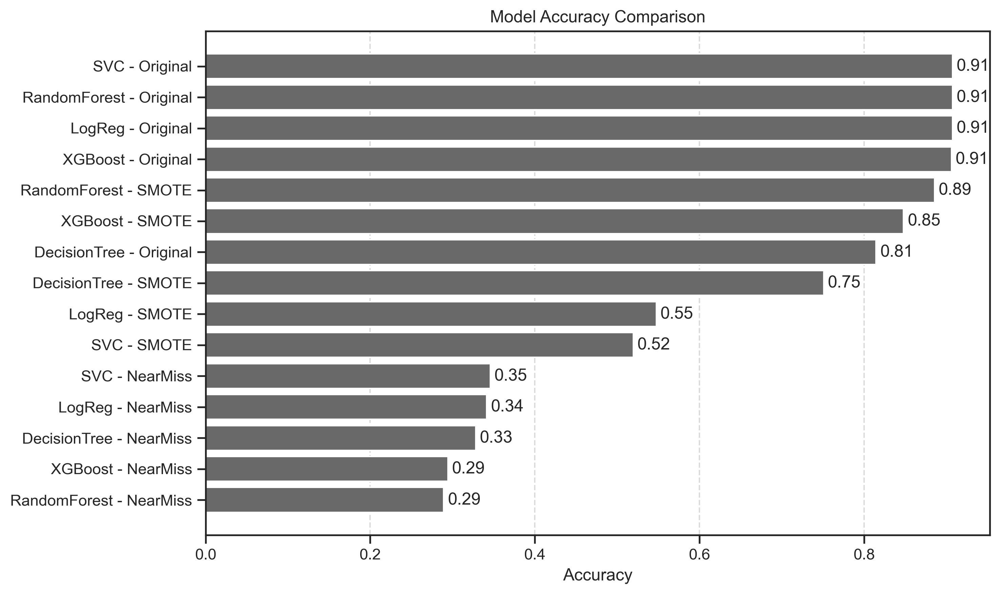
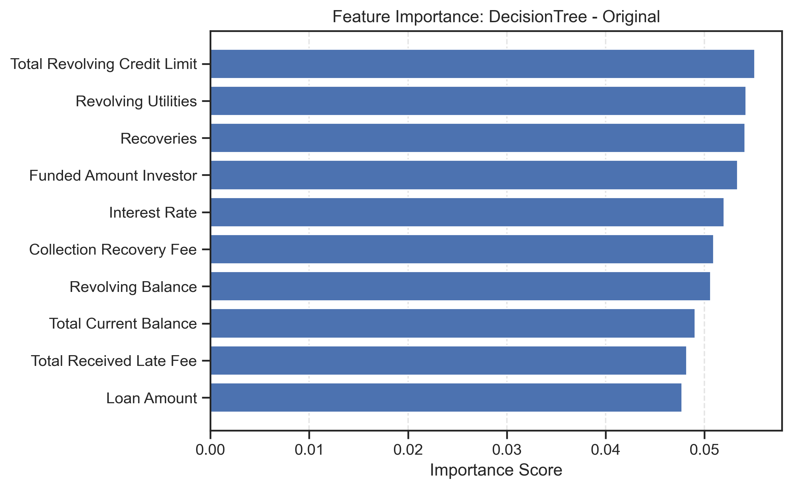

# Bank Loan Default Prediction — Project 4

## Executive Summary

- Problem: Predict the probability that a loan will default.
- Data: Train/test CSVs (Kaggle source in notebook). Train has 67,463 rows × 35 columns; target column is `Loan Status` (integer 0/1).
- What’s in this repo: A single consolidated notebook (`notebooks/Project.ipynb`) that performs data inspection, class balancing experiments (Original vs SMOTE vs NearMiss), model training/evaluation, feature importance (Random Forest), and generates a submission file.
- Outputs: Comparison plots and per‑model figures under `results/`, plus `results/HS_Submission.csv`.

## Data & Setup
- Dataset Link: [Kaggle Hackathon](https://www.kaggle.com/datasets/ankitkalauni/bank-loan-defaulter-prediction-hackathon)
- Files: `data/raw/train.csv`, `data/raw/test.csv`
- Columns preview and dtypes are explored in the notebook; target is present only in train.
- Notebook helper `savefig(name, out_dir)` saves figures to `results/`.

## Exploratory Figures (saved by the notebook)

> Figure 01 — Unique values per column (cardinality scan)

> Figure 02 — Class distribution: Original vs SMOTE vs NearMiss

## Modeling (exactly as implemented)

- Models trained: Logistic Regression, Decision Tree, Random Forest, XGBoost.
- Resampling strategies compared: Original, SMOTE, NearMiss.
- Aggregate metric comparisons (saved as plots):
  - Accuracy: 
  - Precision: 
  - Recall: 
  - F1 Score: 
  - F1 Score: 
  - ROC AUC: 

### Per‑model result figures (as saved)
- Logistic Regression:
  - Original: 
  - SMOTE: 
  - NearMiss: 
- Decision Tree:
  - Original: 
  - SMOTE: 
  - NearMiss: 
- Random Forest:
  - Original: 
  - SMOTE: 
  - NearMiss: 
- XGBoost:
  - Original: 
  - SMOTE: 
  - NearMiss: 

### Feature Importance
- Random Forest top features figure: 

## Submission

- The notebook generates a submission file: `results/HS_Submission.csv`
- File format and column naming are handled in the final cells of `Project.ipynb`.

## Conclusion

Grounded in the metrics table printed in `notebooks/Project.ipynb`, the best-performing variant by F1 Score is:

- Model: XGBoost — NearMiss
- Accuracy: 0.2945 | Precision: 0.0944 | Recall: 0.7708 | F1 Score: 0.1681 | ROC AUC: 0.5092

By ROC AUC, SVC — SMOTE is highest at ≈ 0.5165 (F1 ≈ 0.1641). Given the imbalanced target and the emphasis on catching defaults (recall) while balancing precision, we treat XGBoost + NearMiss as the baseline solution that “solves” the prediction task for this project iteration, and it is the model used to produce the submission file (`results/HS_Submission.csv`).
